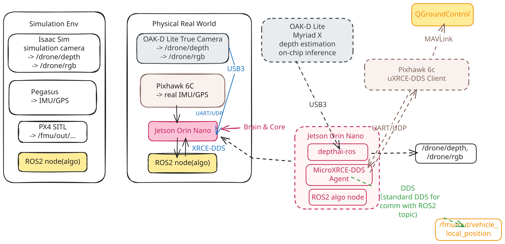

UAV perception pipeline for RGB-D/LiDAR sensing, ROS 2 data acquisition, 3D reconstruction, PX4 integration, and Isaac Sim simulation.

# Drone Ranger

Drone Ranger is a UAV perception and simulation platform for RGB-D/LiDAR sensing, ROS 2 data acquisition, 3D reconstruction, PX4 integration, and Isaac Sim experimentation.

## Overview

### System Architecture

<p align="center">
  
</p>

The Drone Ranger platform provides a unified ROS 2 interface across real-world and simulated UAV environments.
The real platform integrates an OAK-D Lite RGB-D camera, LiDAR, Pixhawk/PX4, and NVIDIA Jetson companion computer.
The simulation stack uses Isaac Sim, Pegasus, and PX4 SITL to expose equivalent sensor and vehicle-state interfaces.

### Hardware

- Holybro X500 V2
- Pixhawk 6C
- [NVIDIA Jetson](https://docs.nvidia.com/jetson/orin-nano-devkit/user-guide/latest/hardware_layout.html)
- OAK-D Lite
- [YDLIDAR T-mini Plus](https://www.yahboom.net/study/T-mini_Plus)

### Software Stack

- Ubuntu 22.04 LTS
   - ROS 2 Humble
- PX4
   Pegasus Simualation
- uXRCE-DDS
- DepthAI
- Reconstruction
   - Colmap
      SFM, MVS
   - Open3D
      Poission Reconstruction
      TSDF

- Nvidia Omniverse
   - Isaac Sim(for simulation)
   - Isaac Lab(for reinforcement learning)

- Foxglove(for ROS2 topic visualization)
- RustDesk(for remote desktop connection to Jetson)

### About this repo

A coherent robot system:
```
                         Drone Ranger
                              │
           ┌──────────────────┼──────────────────┐
           │                  │                  │
      Real Platform       Simulation        Algorithms
           │                  │                  │
    PX4 + Jetson          Isaac Sim       Reconstruction
    OAK-D + LiDAR         Synthetic        Localization
           │               Sensors          Mapping
           └──────────────┬───────────────────┘
                          │
                     ROS 2 Interface
                          │
                 ┌────────┴────────┐
                 │                 │
           Data Collection    Online System
                 │                 │
              ROS Bag          Perception
                 │                 │
          Offline Pipeline    Navigation
                 │
          Reconstruction
                 │
         World Representation
```

## Content Structure

                         DRONE RANGER
                              │
             ┌────────────────┼────────────────┐
             │                │                │
          Hardware        Simulation       Datasets
             │                │                │
             ▼                ▼                ▼
     ┌──────────────┐   ┌────────────┐   ┌───────────┐
     │ OAK-D / LiDAR│   │ Isaac Sim  │   │ ROS bags  │
     │ PX4 / Jetson │   │ Sensors    │   │ Recorded  │
     └──────┬───────┘   └─────┬──────┘   └─────┬─────┘
            │                 │                 │
            ▼                 ▼                 │
      Sensor Drivers     Synthetic Data         │
            │                 │                 │
            └──────────┬──────┘                 │
                       ▼                        │
                  ROS 2 Topics ◀────────────────┘
                       │
          ┌────────────┼────────────┐
          ▼            ▼            ▼
       RGB-D          LiDAR       IMU/PX4
          │            │            │
          └────────────┼────────────┘
                       ▼
              TF + Calibration
                       │
                       ▼
               Data Acquisition
                       │
                       ▼
                   ROS Bag
                       │
                       ▼
                Preprocessing
                       │
                       ▼
            Odometry / Registration
                       │
                       ▼
               3D Reconstruction
                       │
                       ▼
          Point Cloud / TSDF / Mesh
                       │
                       ▼
              World Representation
                       │
                       ▼
            Isaac Sim / Navigation


### Interface Contract

```
                 DRONE RANGER CONTRACT

Topics
────────────────────────
/drone/rgb
/drone/depth
/scan
/fmu/out/...
/tf
/tf_static


Frames
────────────────────────
base_link
oak_rgb_camera_frame
oak_rgb_camera_optical_frame
laser_frame


Data conventions
────────────────────────
timestamps
camera intrinsics
units
coordinate conventions
```

### Real Physical World

```
OAK + LiDAR + PX4
        ↓
    CONTRACT
```

### Simulation World
```
Isaac + SITL
        ↓
    CONTRACT
```

### Reconstruction
```
    CONTRACT
        ↓
reconstruction
```

## Scope

```bash
Real UAV
   ↓
OAK-D + LiDAR + IMU
   ↓
ROS 2
   ↓
Sensor synchronization
   ↓
Data acquisition
   ↓
3D reconstruction
   ↓
World representation
   ↓
Isaac Sim / autonomous navigation
```


## Repository Structure

```bash

```

## Quick Start

...

## Data Collection

...

## Reconstruction

...

## Simulation

...

## Roadmap

...

## Extend in future

drone-ranger-stack
├── ros_ws
│   └── ROS package:
         drone_ranger_bringup
         drone_ranger_mapping

|-- tools
   |-- bag_info.py
      plot_topic_rate.py
      inspect_timestamps.py


## License
