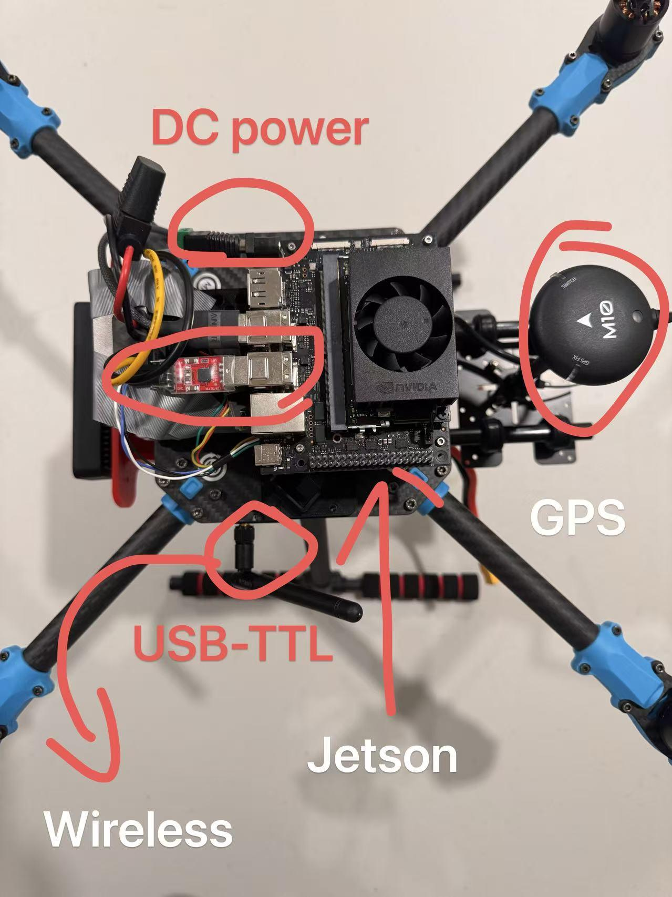
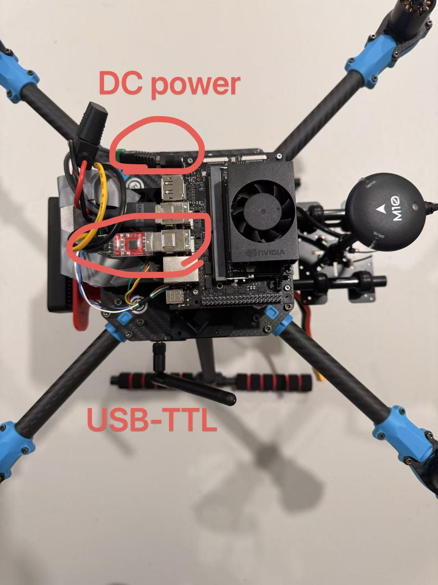
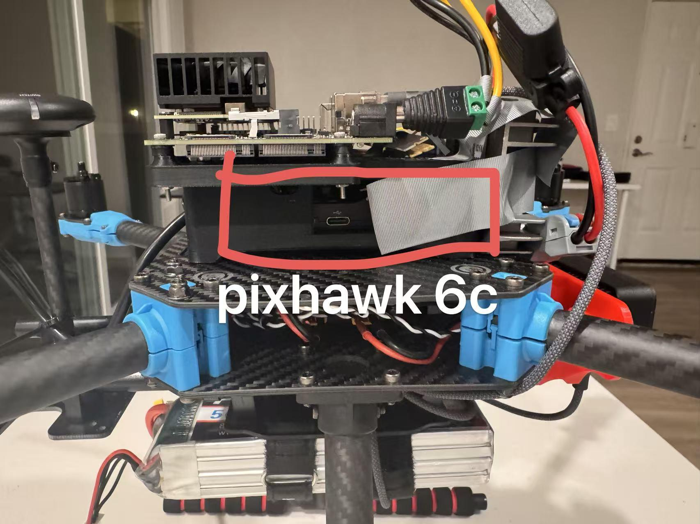
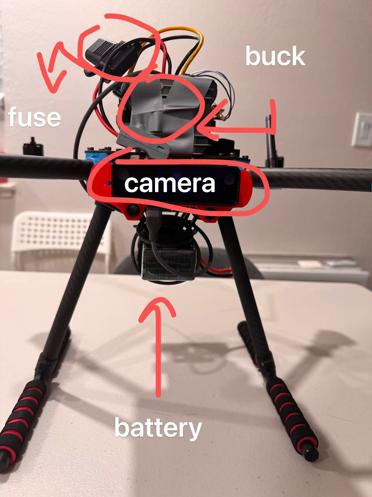
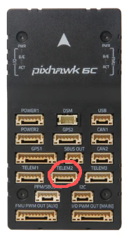

# Hardware Layout


## Assembly

[Holybro X500 V2 + Pixhawk 5C(PX4 Dev Kit)](https://docs.px4.io/main/en/frames_multicopter/holybro_x500v2_pixhawk6c)

X500 V2 Assembly: [6. Power Distribution Board Part2(YouTube)](https://www.youtube.com/watch?v=IfsMXTr3Uy4)


1.    Connect TELEM2 to USB-TTL and plug the adapter into Jetson. Confirm that Jetson sees /dev/ttyUSB0 or the correct serial device.
2.    On PX4, make sure the uXRCE-DDS client is configured for the correct telemetry port and baud rate. The latest known target baud rate was 921600.
3.    On Jetson, start MicroXRCEAgent using the serial device and baud rate.
4.    Source ROS 2 and the PX4 workspace, then echo PX4 output topics to verify data is flowing.
5.    Only after topic flow is stable should offboard nodes be started.

Hardware Layout


Top View


Side View


Front View


PX4



\# Jetson side
```
source /opt/ros/humble/setup.bash
sudo MicroXRCEAgent serial --dev /dev/ttyUSB0 -b 921600
```

\# PX4/NuttX shell side, if starting manually
`uxrce_dds_client start -t serial -d /dev/ttyS3 -b 921600`

\# Verification on Jetson
```
ros2 topic list | grep /fmu
ros2 topic echo /fmu/out/vehicle_local_position --once
ros2 topic echo /fmu/out/vehicle_status --once
```

### MAVLink vs uXRCE-DDS
MAVLink can still be useful for QGC, legacy health checks, and debugging. However, the same TELEM2 serial port should not be assumed to support both MAVLink and uXRCE-DDS at the same time. If communication fails, check PX4 serial-port assignment, baud rate, and whether another protocol is already occupying the port.


## Next Steps:

**Hardware**
1. Establish GPIO communication and free up a port for the LiDAR; 
2. 3D print a housing to enclose the unit and mount the LiDAR on top; 
3. Upgrade from 2D LiDAR to 3D LiDAR; 
4. Address the camera driver issue.


**Simulation**

**Autonomous**