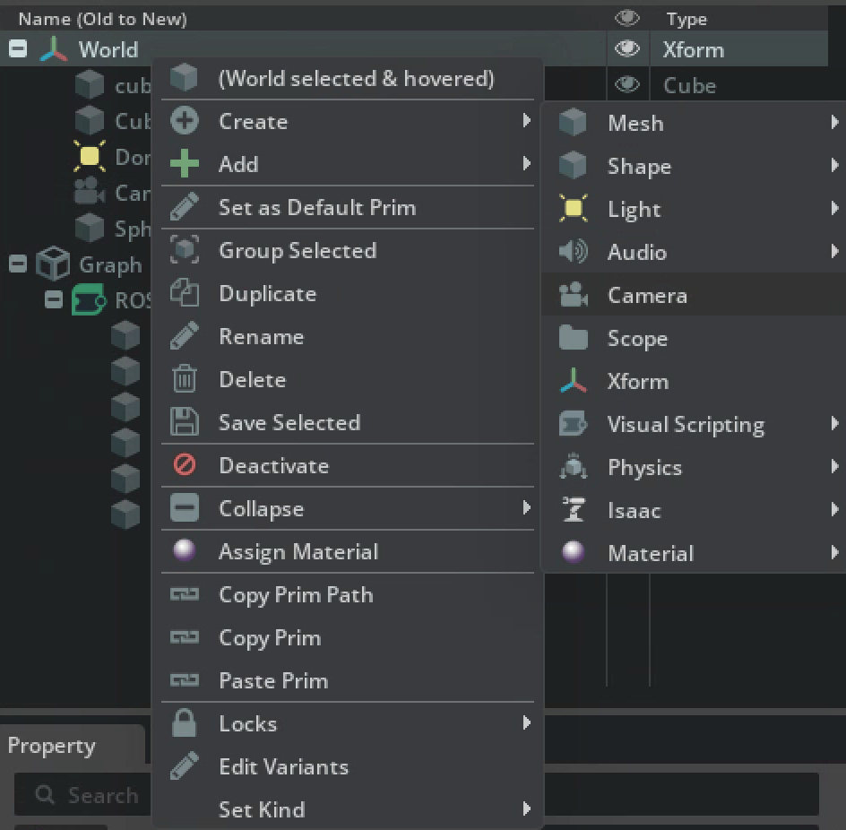
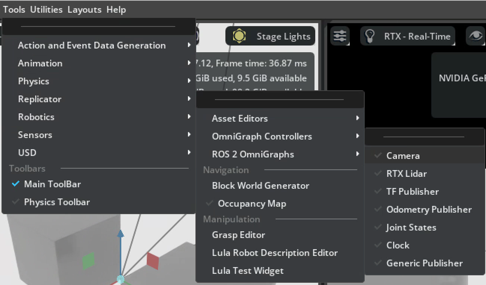
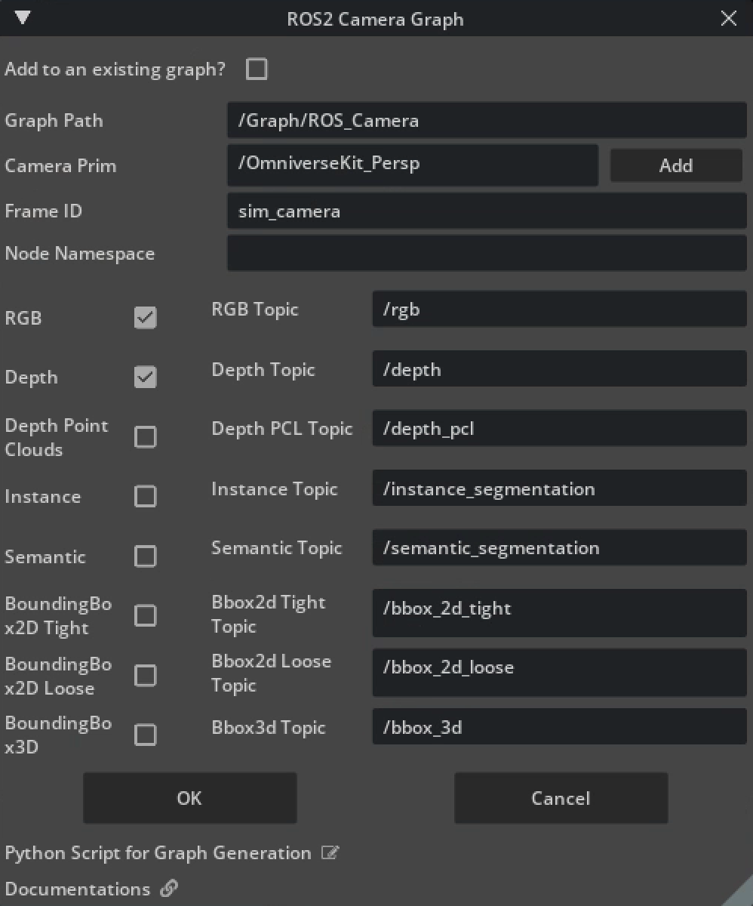
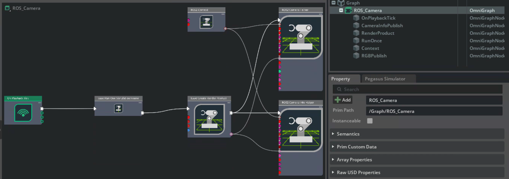
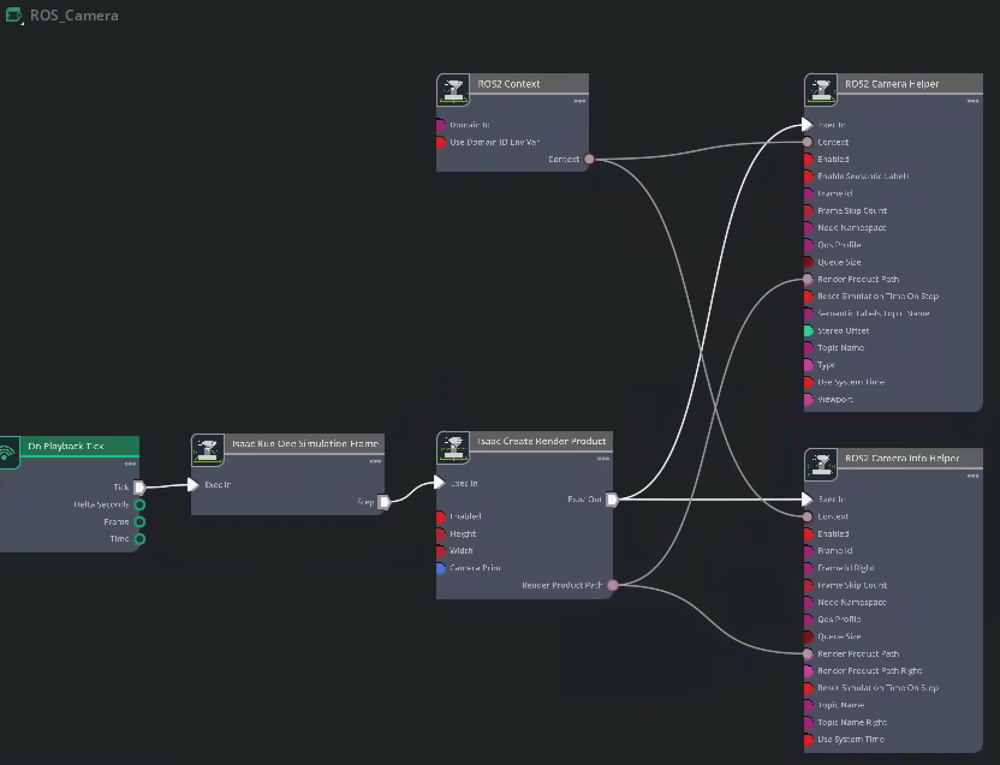

# [ROS2 Cameras](https://docs.isaacsim.omniverse.nvidia.com/5.1.0/ros2_tutorials/tutorial_ros2_camera.html)


## Depth Camera Simulation

### Add depth camera
Create -> camera(name as DepthCam)
    

1. Check ROS2 bridge enabled
    Window -> Extensions -> search ‘ROS2’ -> Enabled

2. Add OmniGraph
    Tools -> Robotics -> ROS2 OmniGraph

    

Parameters:
    - Graph Path
    - Camera Prim
    - Frame ID
    - Node Namespace
    

Checked 'depth'

3. Click 'Play', isaac sim will publish ros2 topic through ROS2 Bridge, to verify the topic:
open a terminal and run command `ros2 topic echo /depth`
    

### Check Action Graph

1. Graph -> ROS_Camera (right click) -> Open Graph
2. Window -> Graph Editors -> Action Graph

    
    

    On PlaybackTick (out: Tick) ->
    Isaac Run One Simulation Frame (in: Exec In; out: Step) ->
    Isaac Create Render Product (in: Exec In; out: Exec Out; out: Render Product Path)
    ROS2 Context(out: Context) ->
    ROS2 Camera Helper(in: Exec In; in: Context; in: Render Product Path)
    ROS2 Camera Info Helper(in: Exec In; in: Context; in: Render Product Path)

### Publish Depth Topic

- Add Camera Prim
    One node in the scene, exists yet not activated, no image output.
- Viewport
    - Switch viewport 
    - Multiple Viewport
        - Window -> Viewport -> Viewport 2(start a new viewport window)
        - Select camera in the viewport
- Let the camera work
    - Output images for ROS2, Python script, sensor
    - Sensor/Annotator (Relicator annotator?)
    - Publish topic through ROS2(co-work with MAVROS2)
        - Add ROS2 Camera Helper(add -> Isaac -> ROS2 -> Camera Helper)
        - Set `frameID`, `topicName`(e.g.,/drone/camera/image_raw)
        - Click “Play”, the topic published.


### Verify Depth Image

#### Check topic
```
Ros2 topic list
ros2 topic echo /depth
Ros2 topic hz /depth
```

"hz" stands for hertz, representing frequency.
The command `ros2 topic hz /drone/rgb` measures, in real-time, the rate at which messages are published to that topic. For instance, an output of `average rate: 30.000` indicates the camera is streaming data at 30 fps, whereas an output of 0 or no response suggests the topic is not publishing at all; this command is commonly used for a quick check to see if a sensor is running.


`ros2 topic echo /depth --no-arr --once`
`ros2 topic echo /depth --no-arr | head -30`

#### Visualization
- rqt_image_view: `ros2 run rqt_image_view rqt_image_view`
> ros2 run rqt_image_view rqt_image_view /rgb    # 看RGB
> ros2 run rqt_image_view rqt_image_view /depth  # 看深度

- rviz2: `rviz2`
Add -> By topic -> /depth -> Image -> OK


- Python Script
    - ***Rclpy*** - python client for ROS2
    To use python to write ROS2 node(subscribe to topic, publish topic), which is installed by ROS2 Humble installation.

    - ***Cv_bridge***
    This is a ROS2 image format conversion bridge library specifically designed to convert `sensor_msgs/Image` (the ROS2 image message format) into OpenCV NumPy arrays, enabling pixel values ​​to be read using Python. It requires a separate installation:`sudo apt install ros-humble-cv-bridge`


