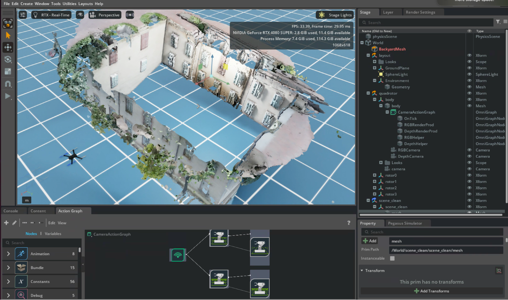

## To run isaac-sim
### 1. docker 
1. run:
```bash
docker run --name isaac-sim --entrypoint bash -it --gpus all -e "ACCEPT_EULA=Y" --rm --network=host \
    -e "PRIVACY_CONSENT=Y" \
    -v ~/docker/isaac-sim/cache/main:/isaac-sim/.cache:rw \
    -v ~/docker/isaac-sim/cache/computecache:/isaac-sim/.nv/ComputeCache:rw \
    -v ~/docker/isaac-sim/logs:/isaac-sim/.nvidia-omniverse/logs:rw \
    -v ~/docker/isaac-sim/config:/isaac-sim/.nvidia-omniverse/config:rw \
    -v ~/docker/isaac-sim/data:/isaac-sim/.local/share/ov/data:rw \
    -v ~/docker/isaac-sim/pkg:/isaac-sim/.local/share/ov/pkg:rw \
    -u 1234:1234 \
    nvcr.io/nvidia/isaac-sim:5.1.0
```
*For details isaac-sim container installation, please refer to [docker installation](https://docs.isaacsim.omniverse.nvidia.com/5.1.0/installation/install_container.html)*


2. run isaac-sim streaming mode:
```bash
cd ~/isaacsim
./isaac-sim.streaming.sh
```
`./isaac-sim.streaming.sh --/app/livestream/publicEndpointAddress=100.118.101.87 --/app/livestream/port=49100`

***Note:***
- The following ports must be opened on the host running Isaac Sim:
`UDP port 47998`
`TCP port 49100`
> To run Isaac Sim on remote instance to be connected via the Internet, add these flags:
> `--/app/livestream/publicEndpointAddress=<PUBLIC_IP>
> --/app/livestream/port=49100`

For an example in a Docker container:

`PUBLIC_IP=$(curl -s ifconfig.me) && ./runheadless.sh --/app/livestream/publicEndpointAddress=$PUBLIC_IP --/app/livestream/port=49100`

Use the same Public IP in the Isaac Sim WebRTC Streaming Client app.


To check the GUI of Isaac-Sim, open the client called “***Isaac-Sim WebRTC Streaming Client***. For details, please refer to [Live Stream Clients](https://docs.isaacsim.omniverse.nvidia.com/5.1.0/installation/manual_livestream_clients.html#isaac-sim-setup-livestream-webrtc)


3. To access docker environment in a new window, run:

`docker exec -it isaac-sim bash`

Example project in isaac sim:
