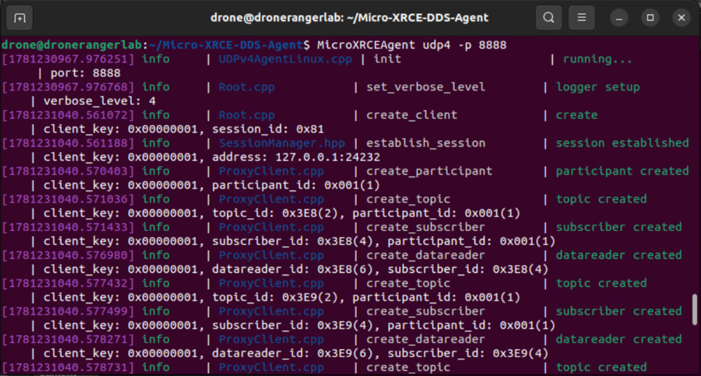
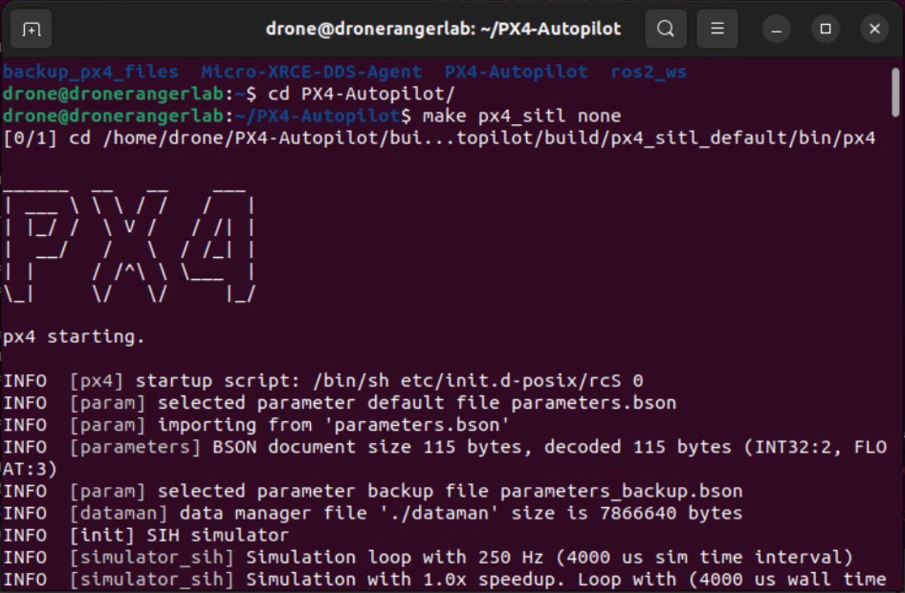
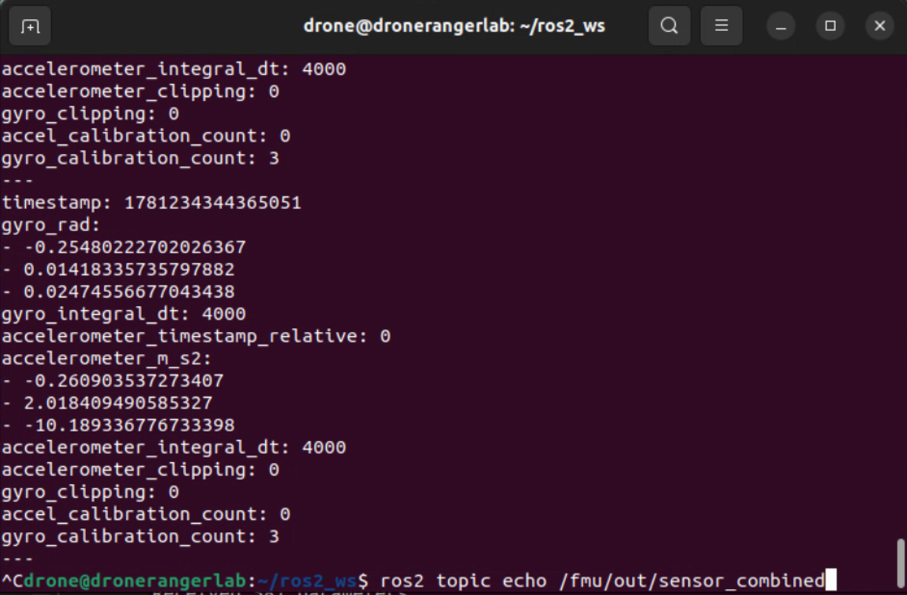
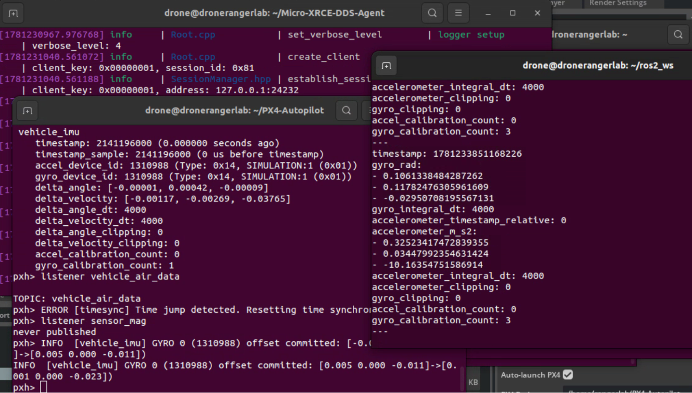

# Communication pipeline

PX4 -> MicroXRCEAgent ->ROS2

### 0.Prepare Linux environment

```bash
sudo apt update && sudo apt upgrade -y
# create normal account (do not use root account in the whole process, PX4 script will alert)
adduser drone
usermod -aG sudo drone
su - drone
```

Verify env：
`uname -m`        # should be x86_64
`lsb_release -a`  # should be Ubuntu 22.04

### 1. Install PX4-Autopilot

**1. Clone repository（designated version，should be consistent with DroneRangerIssac）**

```bash
cd ~
git clone https://github.com/PX4/PX4-Autopilot.git --recursive
cd PX4-Autopilot
git checkout v1.14.3 #(this version doesn’t support gazebo, just to verify the basic communication, to simulate sensor data, should use main branch later)
git submodule update --init --recursive
```


**2. Run official dependency scripts (install compiler, python packages, which should take several minutes)**

`bash ./Tools/setup/ubuntu.sh`
⚠️ after script running, loggin to shell again, to make the environmental variables take effects:
`exit`
`su - drone`   # reconnection through SSH

**3. Install  Python dependencies**
`pip3 install --user kconfiglib jinja2 jsonschema pyros-genmsg \
     packaging toml numpy future empy==3.3.4`

**4. Compile SITL（none means no GUI simulator，pure fly control logic）**
`cd ~/PX4-Autopilot`
`make px4_sitl none`

The compiling time is about 5~ 10 minutes. The success sign:
> [100%] Built target px4

### 2. First time run PX4 SITL

```bash
# start PX4 directly（will enter pxh> intersection shell）
cd ~/PX4-Autopilot
make px4_sitl none
```

You will see output like
```bash
INFO  [px4] Startup script returned successfully
______  __   __    ___
| ___ \ \ \ / /   /   |
| |_/ /  \ V /   / /| |
|  __/   /   \  / /_| |
| |     / /^\ \ \___  |
\_|     \/   \/     |_/

px4 starting.
...
pxh>

enter pxh> means PX4 SITL start successfully
# inside pxh> check several commands, to know flight control status
pxh> commander status       # check flight control status
pxh> param show SYS_AUTOSTART  # check version parameter
pxh> help                   # check all command
pxh> shutdown               # exit
```

### 3. Install ROS 2 Humble
**1. Set locale**
sudo apt install locales
sudo locale-gen en_US en_US.UTF-8

```
drone@dronerangerlab:~$ sudo locale-gen en_US en_US.UTF-8
Generating locales (this might take a while)...
  en_US.ISO-8859-1... done
  en_US.UTF-8... done
Generation complete.
```

sudo update-locale LC_ALL=en_US.UTF-8 LANG=en_US.UTF-8
export LANG=en_US.UTF-8

**2. Add ROS2 apt source**
```bash
sudo apt install software-properties-common curl -y
sudo curl -sSL https://raw.githubusercontent.com/ros/rosdistro/master/ros.key \
     -o /usr/share/keyrings/ros-archive-keyring.gpg
echo "deb [arch=$(dpkg --print-architecture) \
     signed-by=/usr/share/keyrings/ros-archive-keyring.gpg] \
     http://packages.ros.org/ros2/ubuntu \
     $(. /etc/os-release && echo $UBUNTU_CODENAME) main" \
     | sudo tee /etc/apt/sources.list.d/ros2.list > /dev/null
```

**3. Install ROS2 Humble（base version，no GUI）**
```bash
sudo apt update
sudo apt install ros-humble-ros-base python3-colcon-common-extensions -y
```

**4. Write into .bashrc，everytime login should auto source**
```bash
echo "source /opt/ros/humble/setup.bash" >> ~/.bashrc
source ~/.bashrc
```

Verify：
`ros2 topic list`

Output:
```
drone@dronerangerlab:~$ ros2 topic list
/fmu/in/obstacle_distance
/fmu/in/offboard_control_mode
/fmu/in/onboard_computer_status
/fmu/in/sensor_optical_flow
/fmu/in/telemetry_status
/fmu/in/trajectory_setpoint
/fmu/in/vehicle_attitude_setpoint
/fmu/in/vehicle_command
/fmu/in/vehicle_mocap_odometry
/fmu/in/vehicle_rates_setpoint
/fmu/in/vehicle_trajectory_bezier
/fmu/in/vehicle_trajectory_waypoint
/fmu/in/vehicle_visual_odometry
/fmu/out/failsafe_flags
/fmu/out/position_setpoint_triplet
/fmu/out/sensor_combined
/fmu/out/timesync_status
/fmu/out/vehicle_attitude
/fmu/out/vehicle_control_mode
/fmu/out/vehicle_local_position
/fmu/out/vehicle_odometry
/fmu/out/vehicle_status
/parameter_events
/rosout
```


**4. Install Micro XRCE-DDS Agent**
THis is the communication bridge between PX4 and ROS 2 (through which the status data inside PX4 was published as ROS2 Topic):
```bash
cd ~
git clone -b v2.4.2 https://github.com/eProsima/Micro-XRCE-DDS-Agent.git
cd Micro-XRCE-DDS-Agent
mkdir build && cd build
cmake ..
make -j$(nproc)
sudo make install
sudo ldconfig /usr/local/lib/
```

verify：
`MicroXRCEAgent --help`   # means install success when output help info

**5. Install px4_msgs**
ROS2 resuqire specific message package to decode data output by PX4：
mkdir -p ~/ros2_ws/src && cd ~/ros2_ws/src
git clone https://github.com/PX4/px4_msgs.git
cd ~/ros2_ws
source /opt/ros/humble/setup.bash
colcon build --symlink-install
echo "source ~/ros2_ws/install/setup.bash" >> ~/.bashrc
source ~/.bashrc


**6.Three-Terminal Joint Commissioning—End-to-End Data Flow Verification**
The critical step，start three SSH session to run separately:

***Terminal 1***：Start XRCE-DDS Agent
`MicroXRCEAgent udp4 -p 8888`

Keep it running, and wait for PX4 connection.



***Terminal 2***：Start PX4 SITL
```bash
cd ~/PX4-Autopilot
make px4_sitl none
```

Wait until `pxh> hint`。
After several seconds, it should reply like below in terminal1:
> [1711234567.123456] info     | ProxyClient.cpp | create_client | ... | client_key: 0xDEADBEEF



Which means the connection between PX4 and DDS Agent is successfully.

***Terminal 3***：verify ROS2 data
```bash
source ~/.bashrc
source ~/ros2_ws/install/setup.bash
```

Check all the ROS2 topics sent out from PX4
`ros2 topic list`

Below is the output:

    /fmu/out/vehicle_local_position
    /fmu/out/vehicle_attitude
    /fmu/out/sensor_combined
    /fmu/out/vehicle_status

**Check the real-time position of drone(currently on ground, xyz should be about 0)**
`ros2 topic echo /fmu/out/vehicle_local_position`

terminal 2（pxh>）：arm and take off

    pxh> commander arm
    pxh> commander takeoff

Back to terminal 3，you should see the value Z changed (ascending in height)in: '/fmu/out/vehicle_local_position'



This is the sign of data communication run through completely. 


**7. Use MAVLink Shell to monitor（further verify）**

Terminal 3: start a new session
python3 ~/PX4-Autopilot/Tools/mavlink_shell.py 0.0.0.0:14550

Check sensor data here:
pxh> listener sensor_baro    # barometer（Pegasus mock 的那个）
pxh> listener sensor_mag     # magnetic
pxh> listener sensor_accel   # accelerometer
pxh> listener vehicle_gps_position  # GPS


## Summary

```
Ubuntu 22.04 VM
├── Terminal 1: MicroXRCEAgent udp4 -p 8888
│                    ↕ UDP :8888
├── Terminal 2: make px4_sitl none  →  pxh> commander arm/takeoff
│                    ↕ UDP :8888 (uXRCE-DDS)
└── Terminal 3: ros2 topic echo /fmu/out/vehicle_local_position
```



